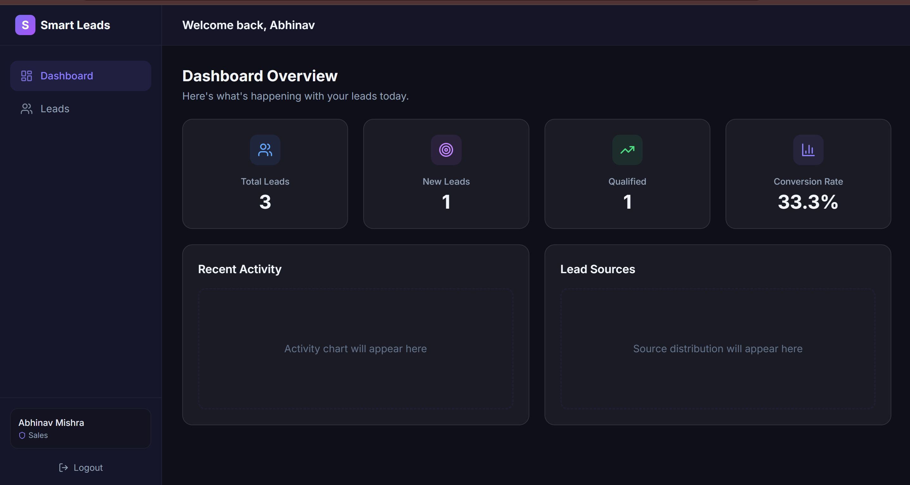
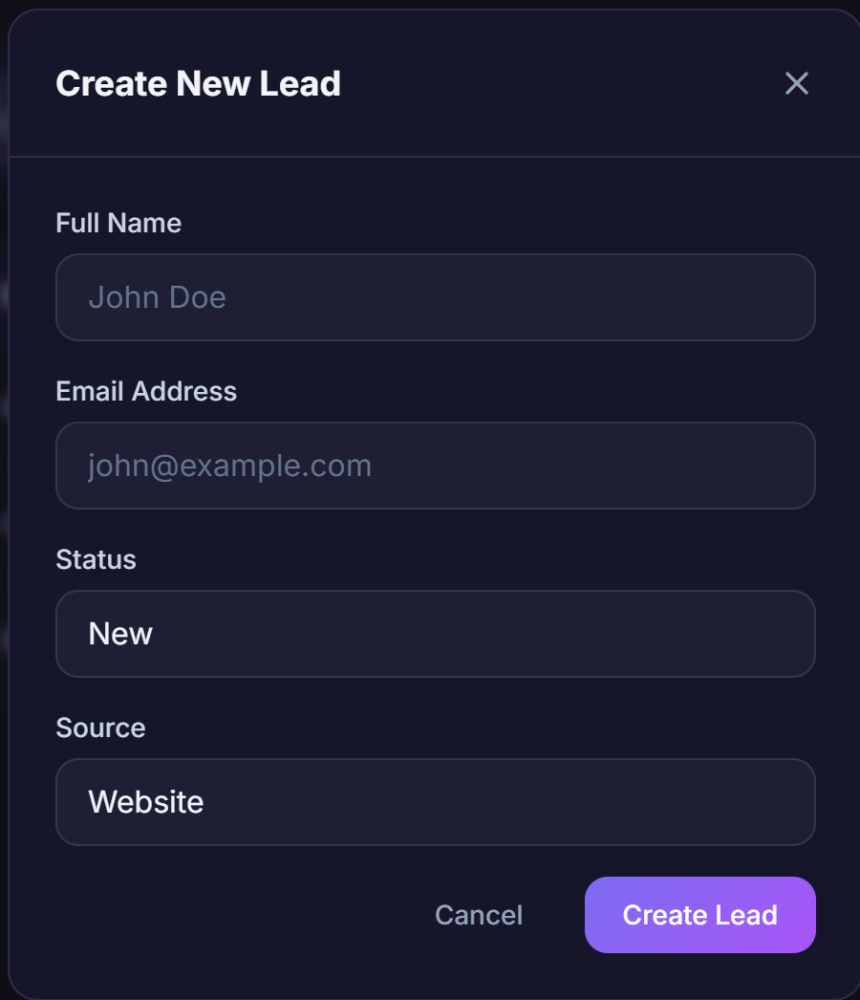

# Smart Leads Dashboard

A full-stack Lead Management Dashboard built with the MERN stack using clean architecture, scalable code practices, and a professional user experience. 

🚀 **Live Demo:** [https://smart-leads-dashboard.vercel.app](https://smart-leads-dashboard.vercel.app) *(Replace with your actual Vercel link once deployed!)*

---

## 📸 Screenshots

*(Add your screenshots here! Create a `docs` folder and upload `dashboard.png` and `modal.png`)*

| Dashboard Analytics | Lead Management Modal |
| :---: | :---: |
|  |  |

---

## Features

*   **Authentication System**: Secure JWT-based authentication with bcrypt password hashing.
*   **Role-Based Access Control (RBAC)**:
    *   **Admin**: Full access to all leads. Can delete leads.
    *   **Sales**: Can only view and update their own leads. Cannot delete leads.
*   **Leads Management (CRUD)**: Create, Read, Update, and Delete leads.
*   **Advanced Filtering & Search**: Filter by status and source, and perform debounced searches by name or email.
*   **Server-Side Pagination**: Efficient data loading with skip and limit.
*   **MongoDB Aggregation**: Uses the `$aggregate` pipeline for instant, highly scalable dashboard statistics.
*   **CSV Export**: Export filtered lead data to CSV format.
*   **Modern UI/UX**: Built with React, TailwindCSS, and Framer Motion for a responsive, dark-mode glassmorphism design.
*   **Dockerized**: Production-ready Nginx multi-stage build and local development via Docker Compose.

## Tech Stack

*   **Frontend**: React.js, TypeScript, TailwindCSS, Vite, Axios, React Router, React Hot Toast, Lucide React.
*   **Backend**: Node.js, Express.js, TypeScript, MongoDB (Atlas/Local), Mongoose, Zod (validation), JWT, bcrypt.
*   **Deployment**: Vercel (Frontend), Render (Backend).

## Getting Started (Local Development)

### Prerequisites
*   Node.js (v18+)
*   Docker & Docker Compose (optional, for local DB/services)
*   MongoDB Atlas URI (if not using Docker)

### Setup Instructions

1.  **Clone the repository:**
    ```bash
    git clone https://github.com/Abhimishra798/smart-leads-dashboard.git
    cd smart-leads-dashboard
    ```

2.  **Environment Variables:**
    *   Navigate to the `backend` directory.
    *   Copy `.env.example` to `.env`: `cp .env.example .env`
    *   Update the `.env` file with your specific configurations (e.g., MongoDB URI, JWT Secret).

3.  **Running with Docker Compose (Recommended):**
    This will start the backend, frontend, and a local MongoDB instance.
    ```bash
    docker compose up --build
    ```
    *   Frontend will be available at `http://localhost:3000`
    *   Backend API will be available at `http://localhost:5000/api`

4.  **Running Manually (without Docker):**
    *   **Backend:**
        ```bash
        cd backend
        npm install
        npm run dev
        ```
    *   **Frontend:**
        ```bash
        cd frontend
        npm install
        npm run dev
        ```

## API Documentation

### Authentication
*   `POST /api/auth/register`: Register a new user (admin/sales).
*   `POST /api/auth/login`: Login and receive a JWT.
*   `GET /api/auth/me`: Get current user details (Protected).

### Leads
*   `GET /api/leads/stats`: Get dashboard aggregation analytics (Protected, RBAC applied).
*   `GET /api/leads`: Get paginated leads with optional filters (`status`, `source`, `search`, `sort`, `page`, `limit`). (Protected, RBAC applied).
*   `POST /api/leads`: Create a new lead. (Protected).
*   `GET /api/leads/:id`: Get a specific lead. (Protected, RBAC applied).
*   `PUT /api/leads/:id`: Update a lead. (Protected, RBAC applied).
*   `DELETE /api/leads/:id`: Delete a lead. (Protected, Admin Only).
*   `GET /api/leads/export/csv`: Export filtered leads as CSV. (Protected, RBAC applied).

## Submission Details

*   **Developer**: Abhinav Mishra 
*   **Email**: ritik.yadav@servicehive.tech (Submission Target)
